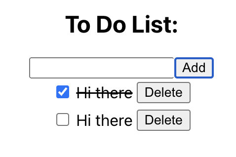

# TodoList

<ul>
  <li>Iterate through the existing tasks using the map method.<li/>
  <li>Allow the user to add a new task, initially set to not completed.<li/>
  <li>Allow the user to remove a task by clicking the delete button.<li/>
  <li>Allow the user to toggle a task's completion property by clicking the checkbox next to it. <li/>
<ul/>
    
 
